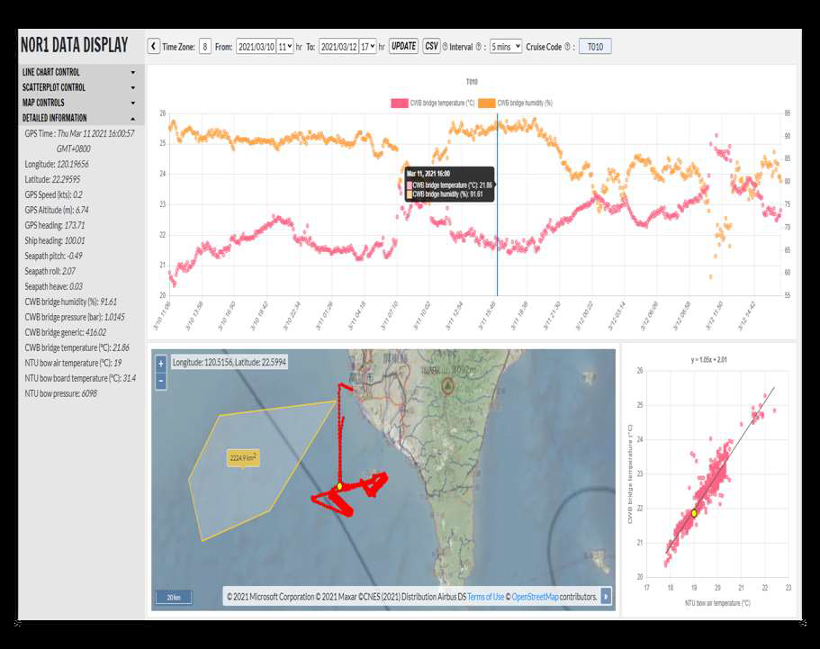
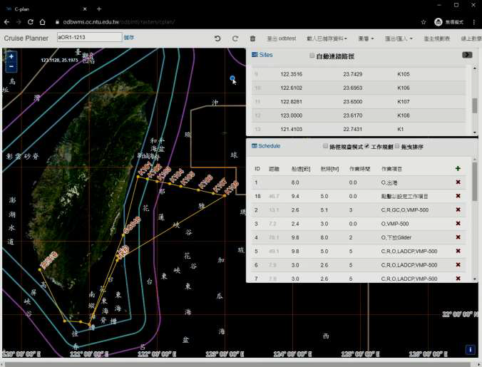
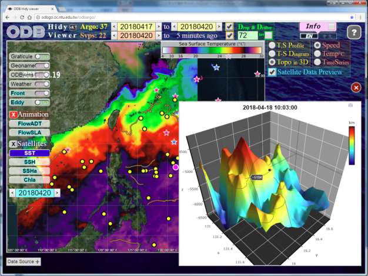

文／劉宜庭｜編輯／何明諠、王家薰

[海洋學門資料庫](https://www.odb.ntu.edu.tw/)(Ocean Data Bank, ODB，下稱「海洋資料庫」) 是台灣大學海洋研究所團隊，從 1987 年起開始運作的跨領域科學研究資料庫，由科技部支持，負責收集與保存國內的海洋研究調查成果，包括彙整海研一、二、三號等國內各研究船的探測資料，將歷年的海洋研究成果系統性分析、整理與展示、支援全國各界海洋研究所需之資料查詢。

海洋資料庫長期致力為政府部門、學研單位、企業及一般大眾，提供經過校驗的水文、海流、水深、震測、聲納、重力、化學、生物等資料。研究團隊善用研究船在海上作業時僅 128 Kbps 的頻寬，發展出獨特的資料整合服務，協助研究者即時上傳資料到視覺化展示平台，監控及管理船上的科研儀器，隨時掌握船隻情況。

海洋資料庫在管理活躍資料 、資料寄存的經驗豐富。2021 年中，[研究資料寄存所](https://data.depositar.io/about)專訪海洋資料庫魏志潾副教授、翁其羽博士、邱銘達博士。在訪談中，研究團隊分享海洋資料庫的資料服務發展歷程、資料的處理、保存與應用的情形、並提供研究者有關資料管理的建議。

## **內部資料交換的機制，成為外部合作的基礎**

海洋資料庫依據「科技部海洋學門海洋量測資料繳交與釋出規定」蒐集海洋資料，以化學海洋資料為例，資料庫的量測數據來源主要有三個，其一是國內海洋研究船（海研一、二、三號等）的電子探針數據，其二是科技部海洋學門計畫主持人上傳系統的量測數據，其三是南海時間序列研究站 (SEATS) 等研究團隊轉移出的歷年採樣實驗數據。除了化學海洋學的資料，海洋資料庫也管理生物海洋學、物理海洋學、海洋地質、海洋地球物理等跨領域的海洋學門資料。

研究團隊指出，海洋資料庫的研究者、管船的單位、資料庫技術人員、海上探測人員，大多都隸屬於同一個單位，因為彼此交流密切，而能夠很方便的彼此溝通需求，逐步演化出整合型的資料服務。

舉例來說，海洋資料庫建立起資料交換的服務整合模式，是因為內部的基本研究需求，「如果內部坐在隔壁的人，取得或更新資料時都那麼麻煩、無法做到程式交換的話，跟外部單位或使用者合作時就會更困難，所以我們是從內部開始做資料交換」。

「其實我們很幸運，當初內部在溝通的時候，就自然往這個方向走。因為內部要做資料交換，所以我們開始去網路找一些公開的協定、公開的服務介面，一路跟著學、跟著做。有了這些基礎後，可以更順利的開始去跟外部單位談資料交換，發展資料交換的共識。」

海洋資料庫當前主要是採分散式的資料儲存結構，「我們希望不用把你的資料完全複製一份，你也不需把我的資料完全複製一份，我們只要可以很容易在機器間去做交換，各自就只需負責自己的資料保存與維護，負擔相對就變少」，與此同時，資料更新的同步問題也可以獲得解決。

研究團隊表示，透過與其它單位進行跨平台資料介接，而非集中型資料倉儲管理的模式，亦可參考氣象局、內政部國土測繪中心基本地形圖為國土資訊系統 (National Geographic Information System, NGIS) 的做法。

## **開發實時展示平台，供研究者隨時掌握研究船儀器情況**

受限於地理空間特性，身處陸海兩地的研究者，要如何得知甚至掌握當下的研究狀況，是海洋研究的一個難題。海洋資料庫為此建立一個展示平台，只要資料進資料庫，研究者透過手機就能立即看到、掌握船上的情況，監控及管理科研儀器；海洋資料庫也蒐集衛星資料、即時呈現國外觀測儀器的資料，讓研究者透過一些資料庫開發的工具進行比對與互動。

「我們在船上放兩台伺服器，虛擬出大概七、八台機器。研究者的資料進到伺服器後，一秒一秒的傳，可以即時秀在網頁上；因為有設備，我們也可以幫忙把一些儀器、畫面直接串流到網路上，送回給研究者跟我們的管理單位。這些畫面也許每小時、每 30 分更新一次，並不那麼即時，但對研究者來說，幫助很大。」

研究者的需求亦非一開始就能掌握，「剛開始我們不會預想到有資料整合、圖層疊加、即時資料視覺化的需求，」研究團隊坦言，「是後來發現大家需要一些資料服務，所以我們把伺服器設備搬到船上、做資料服務的展示。在這個過程中，透過雙向的交流，逐漸發展成互惠的雙贏局面。」

從資料庫管理與研究者需求發展出的資料服務，實務上也廣受漁民、水產試驗所的歡迎。研究團隊指出，「我們在資料服務上的回饋主要來自於學界，但也有漁民申請這些應用，一些單位還會請我們幫忙規劃航次。」

## **跨領域資料處理過程差異大 ，務必保留原始資料**

台灣的海洋資料多屬高度敏感情資，原則上，要使用海洋資料庫的每一種資料都要申請，申請後會審核包括是否有台灣國籍、是否從事學術研究、是否附上科技部的計畫核定清單，或是跟政府單位建教合作的契約等。在海洋資料庫的資料，尤其是二十四海里內的聲學資料、地形資料、物理海洋資料等，都被政府明訂為敏感資料，無法公開取用，「我們目前是開放一些經過處理後的產品，比如說不是高解析度的資料」。

而資料品質的維護與標準化，是資料可否被利用的關鍵。海洋資料庫是一個跨領域的資料庫，研究團隊強調，「資料在各個領域的型態差很多，各領域的技術員都有自己的專業資料技術」。

舉例來說，海洋生物學的資料與海洋地質、地物的資料，資料處理過程就完全不一樣，震測資料儲存前需經訊號轉換，生物資料則多需經實驗室處理，鑑種則需分類學家參與等。為此，海洋資料庫目前分成生物、化學、物理、地質、地球物理領域，各領域皆設有專門進行資料處理的技術員。

儘管海洋資料庫在各領域都有專業的資料處理人員，但資料使用者的角度、標準未必和海洋資料庫一致。「我們自己的資料都會落實品管標準的各個檢驗程序，但如果你認為我們的標準太寬鬆或太嚴格，也可以申請原始資料，我們都會保留原始資料。」在資料品質的把關上，海洋資料庫會在網站上公開各領域的資料品管標準，內部亦有程序檢查資料是否存在明顯錯誤，並標註資料品管的結果。

研究團隊指出，「每個人的研究角度、資料標準本來就不一樣，會牽涉到很多細節，我們希望做到的是，所提供的資料都採用公開、可受檢驗的資料標準」。

## **穩定的經費挹注，有助於資料管理的長遠發展**

海洋學門在台灣是一個涉及國安考量的特殊學門，研究團隊也認為，基於國安因素，經費挹注相對比其他科研資料庫更加穩定及長久，這也是海洋資料庫能持續發展與精進的主要原因。

台灣大部分的科研計畫非常短暫，人力流動迅速，容易導致分歧的資料品質或資訊技術。而海洋資料庫穩定的資金，很大程度減輕了這個問題的嚴重性，也幫助其資料利用。研究團隊說，「海洋資料庫因為一直在演進，可以把過去的骨幹慢慢改過來，跟外部接軌。我們也觀察到，很多研究單位只能在一個錯誤的架構上進行，沒有能力或資源去做修正，最後在串接國內很多單位的資料時，就會有很多東西接不起來，本質上是因為架構上存在很多不一致的地方。」

如何解決這個問題？研究團隊指出，如果無法投入足夠的資源管理研究資料，則建議研究者可以敞開心胸、把資料交給值得信任的負責機構，讓研究資料更方便管理、創造出更多價值。
